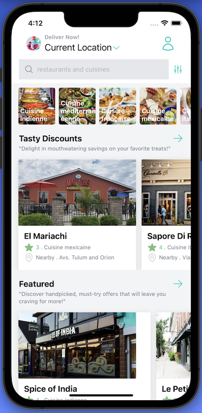
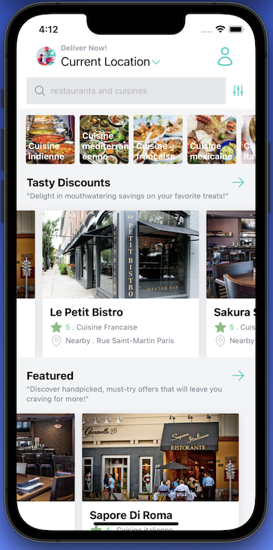
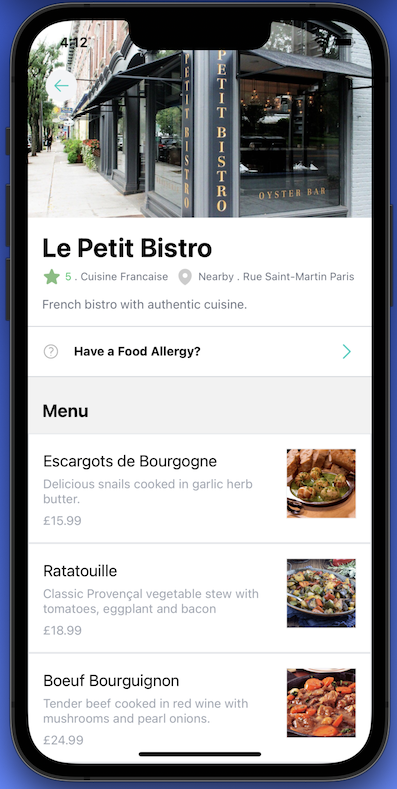
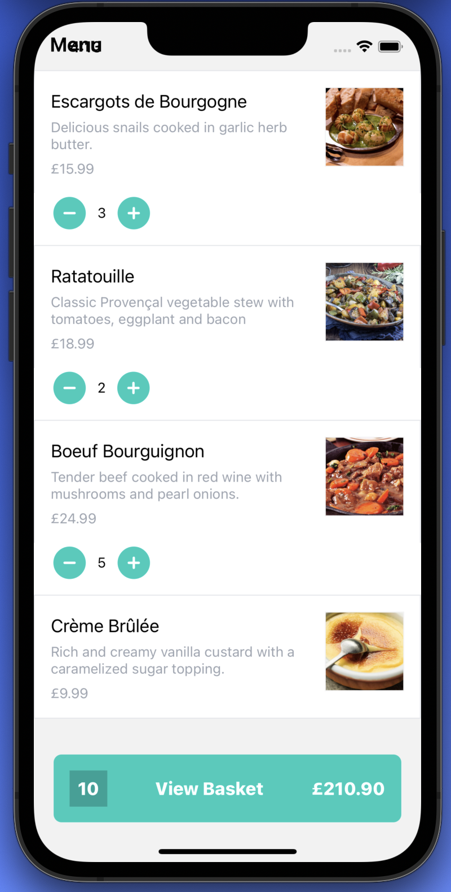
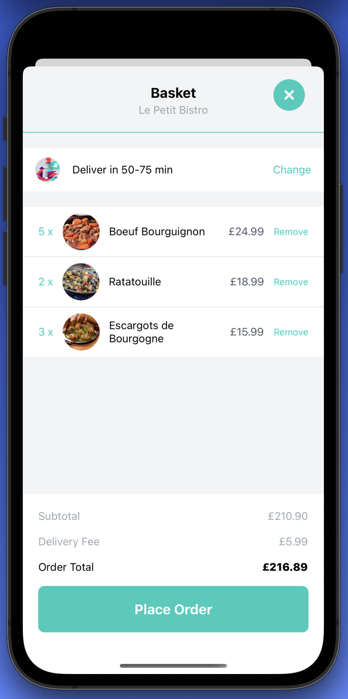
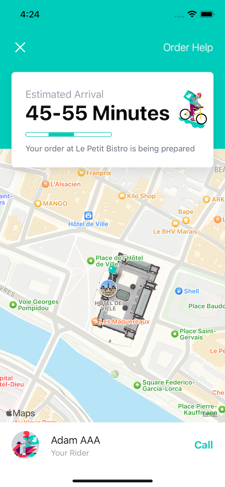

# React Native Application - Deliveroo Clone 👨‍🍳🍕

Welcome to the GitHub repository of our React Native application, which is a Deliveroo clone inspired by Sonny Sangha's YouTube tutorial 🍽️. This application allows you to create an experience similar to Deliveroo, enabling users to browse restaurants, place orders, and have their favorite meals delivered  🍽️. This application utilizes the following technologies and libraries:

<div align="center">
  
  
  
  
</div>
<div align="center">
  <p style="font-family: Ubuntu, sans-serif; color: #777777;">Sanity CMS</p>
  <p style="font-family: Ubuntu, sans-serif; color: #777777;">NativeWind</p>
  <p style="font-family: Ubuntu, sans-serif; color: #777777;">ReactNavigation</p>
  <p style="font-family: Ubuntu, sans-serif; color: #777777;">React Redux</p>
</div>


## Features 🎯

- Display a list of available restaurants 🍔
- Show restaurant details, including menu and relevant information 📋
- Add dishes to the cart 🛒
- Validate orders and proceed to the payment screen 💳
- Support the payment process (non-real) 💰
- Manage order tracking and real-time updates 🚚
- Display the history of past orders 📚
- User-friendly and responsive user interface 🎨

## Screenshots 📸

<div>
  
  
</div>

<div>
  
  
</div>

<div>
  
  
</div>

## Installation ⚙️

To run the application locally, follow the steps below:

1. Clone this repository to your local machine using the following command:

   ```
   git clone https://github.com/your-username/deliveroo-clone.git
   ```

2. Navigate to the cloned directory:

   ```
   cd deliveroo-clone
   ```

3. Install the dependencies using the following command:

   ```
   npm install
   ```

4. Launch the application on an Android or iOS emulator using the appropriate command:

   - Android:

     ```
     react-native run-android
     ```

   - iOS:

     ```
     react-native run-ios
     ```

Make sure you have set up your development environment to run React Native applications.

## Contributions 👥

Contributions are welcome! If you would like to contribute to this project, please follow the steps below:

1. Fork this repository
2. Create a branch for your feature or bug fix: `git checkout -b my-feature`
3. Make the necessary changes and commit: `git commit -am 'Add new feature'`
4. Push the changes to your fork: `git push origin my-feature`
5. Submit a pull request to the main branch of this repository

## Authors ✍️

- Maxence Cuingnet - [GitHub](https://github.com/adamfrance)

This project is inspired by Sonny Sangha's YouTube tutorial. Special thanks to Sonny Sangha for the inspiration and guidance.

Feel free to contact us if you have any questions or comments! 💬

## License 📝

This project is licensed under the MIT License. See the `LICENSE` file for more information.
